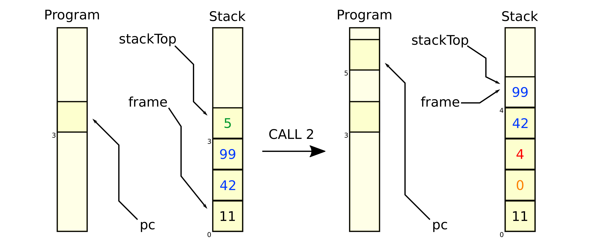

# Compiler
Programming exercise in the course of the practical lecture _Fundamentals of Programming_ (IN0002) at the Technical University of Munich.

## Packages
### Compiler
Translates a given program of the grammar below into Assembler.

**Supported Instructions**
```
NOP, ADD, SUB, MUL, MOD, LDI, LDS, STS, JUMP, JE, JNE, JLT, CALL, RETURN, IN, OUT, HALT, ALLOC, LDH, STH, ALLOCH
```

### Interpreter
The simulated machine has an int stack of size 128 as memory; all instructions are stored in a separate program memory. Arguments are consumed from the stack and results are put on the stack again. In addition, some instructions have a single argument, which is stored directly in the program as part of the instruction (immediate).



### Optimizer
Tail Call Optimization making a jump from a recursive call. The old stack frame is kept, the control flow goes back to the beginning of the function.

### Parser
Recursive Descent Parser providing a method for each non-terminal of the grammar below. Each of these methods expects an array consisting of tokens as parameters and a start index.


## Supported Grammar
```
<program>     ::=   <function>*

<function>    ::=   <type> <name> (<params>) { <decl>* <stmt>* }

<params>      ::=   ∈ | (<type> <name>)(, <type> <name>)*

<decl>        ::=   <type> <name> (, <name> )* ;

<type>        ::=   int | int[]

<stmt>        ::=   ; 
                    | <name> = <expr>; 
                    | <name> [ <expr> ] = <expr>; 
                    | <name> = read(); 
                    | write( <expr> ); 
                    | if ( <cond> ) <stmt> 
                    | if ( <cond> ) <stmt> else <stmt>
                    | while ( <cond> ) <stmt>
                    | return <expr>;
                    
<expr>        ::=   <number>
                    | <name>
                    | new int [ <expr> ]
                    | <expr> [ <expr> ]
                    | <name> ( (∈ | <expr>(, <expr>)*) )
                    | length ( <expr> )
                    | ( <expr> )
                    | <unop> <expr>
                    | <expr> <binop> <expr>
                    
<unop>        ::=   -

<binop>       ::=   - | + | * | / | %

<cond>        ::=   true | false
                    | ( <cond> )
                    | <expr> <comp> <expr>
                    | <bunop> ( <cond> )
                    | <cond> <bbinop> <cond>
                    
<comp>        ::=   == | != | <= | < | >= | >

<bunop>       ::=   !

<bbinop>      ::=   && | ||
```
